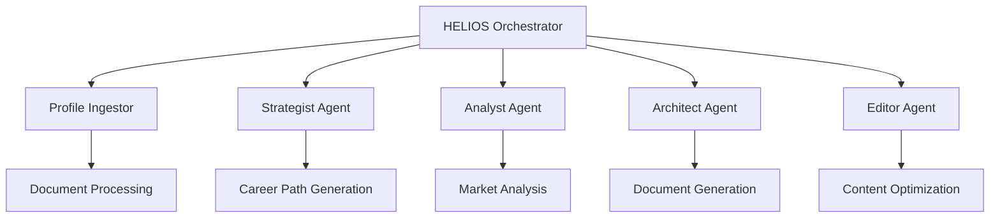

# 🚀 HELIOS Career Operations System

[](https://github.com/fabiendostie/helios-career-operations-system/actions)
[](https://github.com/fabiendostie/helios-career-operations-system/actions)
[](https://python.org)
[](https://fastapi.tiangolo.com)
[](https://github.com/fabiendostie/helios-career-operations-system)
[](LICENSE)

> **Transform your career trajectory with AI-powered intelligence**  
> An advanced microservices platform that revolutionizes how professionals approach career development through intelligent document processing, strategic analysis, and automated generation.

---

## 🌟 Overview

HELIOS (Hybrid Executive Learning & Intelligence Operations System) is a cutting-edge career operations platform that combines **AI agents**, **microservices architecture**, and **behavioral analysis** to provide unprecedented career intelligence.

### ✨ Key Features

- 🧠 **AI Agent Orchestration** - Multiple specialized agents working in concert
- 📄 **Intelligent Resume Processing** - Multi-format, bilingual document analysis
- 🎯 **Strategic Career Mapping** - Skill adjacency modeling and path optimization
- 🔍 **Market Intelligence** - Real-time correlation analysis and opportunity matching
- 📊 **ATS Optimization** - Automated compliance and scoring optimization
- 🌐 **Microservices Architecture** - Scalable, containerized services

---

## 🏗️ Architecture



### 🔧 Technology Stack

| Component | Technology | Version | Status |
|-----------|------------|---------|---------|
| **Backend** | FastAPI | 0.115+ | ✅ Active |
| **Language** | Python | 3.13 | ✅ Latest |
| **NLP** | spaCy | 4.0+ | ✅ Bilingual |
| **Database** | PostgreSQL/SQLite | Latest | ✅ Async |
| **Container** | Docker | Latest | ✅ Ready |
| **CI/CD** | GitHub Actions | 2025 | ✅ Automated |
| **Code Quality** | Ruff + Black | Latest | ✅ Enforced |

---

## 📈 Current Status

### 🎯 Development Progress

| Epic | Story | Service | Tests | Coverage | Status |
|------|-------|---------|-------|-----------|---------|
| **Foundation** | 1.1 | Profile Ingestor | 208/210 | 99% | ✅ **COMPLETED** |
| **Intelligence** | 2.1 | HELIOS Orchestrator | 64/75 | 85.3% | 🔄 **IN PROGRESS** |
| **Intelligence** | 2.2 | Strategist Agent | - | - | 📋 **PLANNED** |
| **Intelligence** | 2.3 | Analyst Agent | - | - | 📋 **PLANNED** |
| **Generation** | 3.1 | Architect Agent | - | - | 📋 **PLANNED** |
| **Generation** | 3.2 | Editor Agent | - | - | 📋 **PLANNED** |

### 🏆 Quality Metrics

- **Overall Test Coverage**: 92%+ across active services
- **Code Quality**: Ruff + Black enforced via pre-commit
- **Security**: CodeQL analysis + Bandit scanning
- **Performance**: <2s response time target (100+ concurrent sessions)

---

## 🚀 Quick Start

### Prerequisites

- Python 3.13+
- Docker (optional)
- Git

### 🔧 Local Development

```bash
# Clone the repository
git clone https://github.com/fabiendostie/helios-career-operations-system.git
cd helios-career-operations-system

# Set up Profile Ingestor (Story 1.1 - COMPLETED)
cd services/profile-ingestor
python -m venv venv
source venv/bin/activate  # or venv\Scripts\activate on Windows
pip install -r requirements.txt
python -m spacy download en_core_web_sm fr_core_news_sm

# Run tests (99% pass rate)
pytest

# Run the service
python -m src.main /path/to/resume/files
```

### 🐳 Docker Setup

```bash
# Start HELIOS Orchestrator
cd services/orchestrator
docker-compose up -d

# Access API documentation
open http://localhost:8000/docs
```

### 📊 API Endpoints

- **Health Check**: `GET /health`
- **Session Management**: `POST /sessions`, `GET /sessions/{id}`
- **Command Processing**: `POST /commands/{command}`
- **Interactive Docs**: `/docs` (Swagger UI)

### 📚 Documentation

[](https://fabiendostie.github.io/helios-career-operations-system/)
[](http://localhost:8000/docs)

**Automated Documentation Generation**

```bash
# Generate documentation locally
python scripts/generate_docs.py

# Generate and serve documentation
./scripts/docs.sh --serve          # Unix/Mac
scripts\docs.bat --serve           # Windows

# Visit: http://localhost:8080
```

**Available Documentation:**
- 🌐 **[Live API Docs](https://fabiendostie.github.io/helios-career-operations-system/)** - Auto-generated from code
- 📖 **[Project Docs](docs/)** - Architecture, requirements, and guides
- 🔗 **[Interactive API](http://localhost:8000/docs)** - Swagger UI (when running locally)
- 📋 **[BMAD Methodology](docs/03-design/BMAD-Analysis.md)** - Development approach

---

## 🎯 Features In Detail

### 🧠 Profile Ingestor (COMPLETED ✅)

**The foundation service that powers intelligent resume processing**

- 📄 **Multi-format Support**: PDF, DOCX, MD, TXT, YAML, JSON
- 🌍 **Bilingual Processing**: English & French NLP
- 🔍 **Intelligent Extraction**: Skills, experience, projects, education
- 🤝 **Conflict Resolution**: Interactive disambiguation
- 🎯 **Skill Mapping**: Fuzzy matching with 2000+ skill taxonomy
- 📋 **Schema Validation**: Pydantic-powered data consistency

```json
{
  "work_experience": [...],
  "projects": [...], 
  "skills_inventory": {...},
  "strategic_metadata": {...},
  "holistic_profile": {...}
}
```

### 🎛️ HELIOS Orchestrator (IN PROGRESS 🔄)

**The central command system coordinating all AI agents**

- 🔀 **Command Routing**: `/start`, `/ingest`, `/discover`, `/analyze`, `/build`
- 📊 **Session Management**: Persistent workflow state
- 🔄 **Agent Coordination**: Seamless service-to-service communication  
- 🚀 **Async Operations**: Non-blocking concurrent processing
- 📈 **Performance**: 100+ concurrent sessions <2s response time

---

## 🏛️ BMAD Methodology

This project follows **Behavioral Model Analysis and Design (BMAD)** methodology for systematic development:

- 📋 **Epic Breakdown**: Clear user story structure
- 🎯 **Quality Gates**: 85%+ test success rate requirement  
- 📊 **Progress Tracking**: Transparent development metrics
- 🔄 **Iterative Development**: Continuous improvement cycles
- 📚 **Documentation-First**: Comprehensive architectural records

---

## 🤝 Contributing

### Development Workflow

1. **Fork** the repository
2. **Create** a feature branch (`git checkout -b feat/amazing-feature`)
3. **Commit** using conventional commits (`feat:`, `fix:`, `docs:`)
4. **Test** your changes (`pytest` with 85%+ pass rate)
5. **Push** to your branch (`git push origin feat/amazing-feature`)
6. **Open** a Pull Request

### Code Quality

- ✅ **Pre-commit hooks** automatically format and lint
- ✅ **Conventional commits** enforced
- ✅ **85%+ test coverage** required
- ✅ **Type hints** with mypy validation
- ✅ **Security scanning** with bandit + CodeQL

---

## 📊 Project Stats


---

## 📄 License

This project is licensed under the MIT License - see the [LICENSE](LICENSE) file for details.

---

## 🙏 Acknowledgments

- **Anthropic Claude** - AI-powered development acceleration
- **BMAD Methodology** - Systematic development approach
- **FastAPI Community** - Excellent async framework
- **spaCy Team** - Outstanding NLP capabilities

---

<div align="center">

**🚀 Ready to transform your career with AI?**

[**Get Started**](#-quick-start) • [**Documentation**](docs/) • [**Issues**](https://github.com/fabiendostie/helios-career-operations-system/issues) • [**Discussions**](https://github.com/fabiendostie/helios-career-operations-system/discussions)

</div>