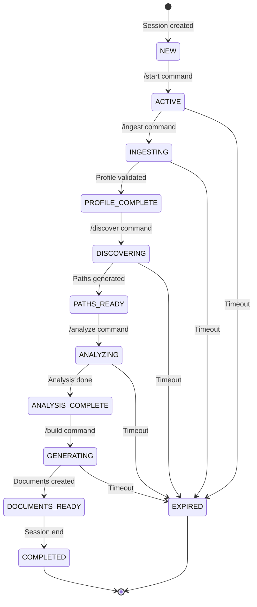

# BMAD (Behavioral Model Analysis and Design) Document
# Helios Career Operations System

## Document Metadata
- **Version:** 1.0
- **Date:** 2025-01-04
- **Author:** System Architecture Team
- **Status:** Draft
- **Methodology:** BMAD Brownfield Extension

---

## 1. System Overview

### 1.1 System Purpose
The Helios Career Operations System is a multi-agent AI platform that transforms career development through intelligent data processing, market analysis, and document generation.

### 1.2 System Boundaries
```
┌─────────────────────────────────────────────────────────┐
│                   SYSTEM BOUNDARY                       │
│                                                         │
│  Internal:                                              │
│  - User Management                                      │
│  - Agent Orchestration                                  │
│  - Data Processing                                      │
│  - Document Generation                                  │
│                                                         │
│  External:                                              │
│  - Job Boards (LinkedIn, Indeed)                       │
│  - LLM Providers (OpenAI, Anthropic)                   │
│  - Cloud Services (AWS)                                 │
│  - Payment Systems (Stripe)                            │
└─────────────────────────────────────────────────────────┘
```

---

## 2. Entity Analysis

### 2.1 Primary Entities

#### 2.1.1 User
```yaml
entity: User
type: Actor
attributes:
  - userId: UUID
  - email: String
  - profile: UserProfile
  - subscription: SubscriptionTier
  - sessions: List[Session]
  - documents: List[Document]
  - preferences: UserPreferences

behaviors:
  - register()
  - authenticate()
  - uploadResume()
  - initiateSession()
  - executeCommand()
  - downloadDocument()
  - provideFeedback()

relationships:
  - owns: [Profile, Documents, Sessions]
  - uses: [Agents, Services]
  - subscribes: [Plans]
```

#### 2.1.2 Session
```yaml
entity: Session
type: Core Business Entity
attributes:
  - sessionId: UUID
  - userId: UUID
  - state: SessionState
  - startTime: DateTime
  - commands: List[Command]
  - context: SessionContext

behaviors:
  - initialize()
  - updateState()
  - processCommand()
  - maintain
Context()
  - terminate()

states:
  - NEW
  - ACTIVE
  - INGESTING
  - ANALYZING
  - GENERATING
  - COMPLETED
  - EXPIRED
```

#### 2.1.3 CareerProfile
```yaml
entity: CareerProfile
type: Core Business Entity
attributes:
  - profileId: UUID
  - personalInfo: PersonalInfo
  - workExperience: List[Experience]
  - education: List[Education]
  - skills: SkillInventory
  - projects: List[Project]
  - aspirations: CareerAspirations
  - constraints: CareerConstraints

behaviors:
  - validate()
  - enrich()
  - vectorize()
  - compareWith()
  - generateSummary()

derived_attributes:
  - competencyVector: Vector
  - careerAnchors: List[Anchor]
  - riasecCode: String
```

#### 2.1.4 Agent (Abstract)
```yaml
entity: Agent
type: System Actor
subtypes:
  - ProfileIngestorAgent
  - StrategistAgent
  - AnalystAgent
  - ArchitectAgent
  - EditorAgent

common_attributes:
  - agentId: String
  - version: String
  - status: AgentStatus
  - knowledgeBase: KnowledgeBase
  - configuration: AgentConfig

common_behaviors:
  - processRequest()
  - validateInput()
  - executeTask()
  - generateResponse()
  - logActivity()

polymorphic_behaviors:
  ProfileIngestorAgent:
    - conductInterview()
    - extractEntities()
    - resolveConflicts()

  StrategistAgent:
    - generateCareerPaths()
    - calculateFitScores()
    - identifyOpportunities()

  AnalystAgent:
    - performMarketAnalysis()
    - assessATSReadiness()
    - identifySkillGaps()

  ArchitectAgent:
    - generateResume()
    - createCoverLetter()
    - optimizeForATS()

  EditorAgent:
    - rewriteBulletPoint()
    - enhanceLanguage()
    - extractMetrics()
```

#### 2.1.5 Document
```yaml
entity: Document
type: Business Entity
attributes:
  - documentId: UUID
  - type: DocumentType
  - content: String
  - metadata: DocumentMetadata
  - version: Integer
  - createdAt: DateTime

types:
  - RESUME
  - COVER_LETTER
  - LINKEDIN_PROFILE
  - PORTFOLIO
  - CAREER_REPORT

behaviors:
  - generate()
  - validate()
  - export()
  - version()
  - optimize()
```

#### 2.1.6 MarketData
```yaml
entity: MarketData
type: Reference Entity
attributes:
  - jobListings: List[JobListing]
  - salaryBenchmarks: List[SalaryData]
  - skillDemand: Map[Skill, Demand]
  - industryTrends: List[Trend]
  - companyInsights: List[CompanyData]

behaviors:
  - aggregate()
  - analyze()
  - predict()
  - correlate()
  - refresh()
```

### 2.2 Secondary Entities

#### 2.2.7 Command
```yaml
entity: Command
type: Value Object
attributes:
  - commandType: CommandEnum
  - parameters: Map[String, Any]
  - timestamp: DateTime
  - source: CommandSource

commands:
  - /start
  - /ingest
  - /discover
  - /analyze
  - /build
  - /rewrite
  - /status
  - /help
```

#### 2.2.8 SkillInventory
```yaml
entity: SkillInventory
type: Aggregate Entity
attributes:
  - technicalSkills: List[Skill]
  - softSkills: List[Skill]
  - tools: List[Tool]
  - certifications: List[Certification]
  - languages: List[Language]

behaviors:
  - categorize()
  - mapBilingual()
  - assessProficiency()
  - identifyGaps()
  - recommend()
```

#### 2.2.9 CareerPath
```yaml
entity: CareerPath
type: Value Object
attributes:
  - pathId: String
  - targetRole: String
  - fitScore: Float
  - requirements: List[Requirement]
  - timeline: TimeEstimate
  - steps: List[CareerStep]

behaviors:
  - evaluate()
  - compare()
  - visualize()
```

---

## 3. Boundary Objects

### 3.1 External System Boundaries

#### 3.1.1 File System Interface
```yaml
boundary: FileSystemInterface
type: External Interface
purpose: Handle file operations for document upload/download
operations:
  - uploadFile(file: Binary): FileHandle
  - downloadFile(handle: FileHandle): Binary
  - deleteFile(handle: FileHandle): Boolean
  - validateFile(file: Binary): ValidationResult

protocols:
  - Multipart form upload
  - Chunked transfer
  - Resume support
```

#### 3.1.2 LLM Provider Interface
```yaml
boundary: LLMProviderInterface
type: External Service Interface
providers:
  - OpenAI
  - Anthropic

operations:
  - generateText(prompt: String, params: LLMParams): String
  - generateEmbedding(text: String): Vector
  - moderateContent(text: String): ModerationResult

constraints:
  - Rate limiting
  - Token limits
  - Cost management
```

#### 3.1.3 Job Board Interface
```yaml
boundary: JobBoardInterface
type: External Data Interface
sources:
  - LinkedIn API
  - Indeed API
  - Custom scrapers

operations:
  - searchJobs(criteria: SearchCriteria): List[JobListing]
  - getJobDetails(jobId: String): JobDetails
  - getCompanyInfo(companyId: String): CompanyInfo
  - getMarketTrends(): TrendData
```

#### 3.1.4 Payment Gateway Interface
```yaml
boundary: PaymentInterface
type: External Transaction Interface
provider: Stripe
operations:
  - createCustomer(user: User): CustomerId
  - createSubscription(plan: Plan): Subscription
  - processPayment(amount: Money): PaymentResult
  - cancelSubscription(subId: String): Boolean
```

### 3.2 Internal System Boundaries

#### 3.2.1 CLI Interface
```yaml
boundary: CommandLineInterface
type: User Interface
operations:
  - parseCommand(input: String): Command
  - displayResponse(response: Response): Unit
  - showProgress(progress: Progress): Unit
  - handleInterrupt(): Unit
```

#### 3.2.2 Web API Interface
```yaml
boundary: WebAPIInterface
type: Service Interface
endpoints:
  sessions:
    - POST /sessions/start
    - GET /sessions/{id}
    - POST /sessions/{id}/command
    - DELETE /sessions/{id}

  documents:
    - POST /documents/upload
    - GET /documents/{id}
    - POST /documents/generate

  profiles:
    - GET /profiles/{id}
    - PUT /profiles/{id}
    - POST /profiles/analyze
```

#### 3.2.3 Agent Communication Interface
```yaml
boundary: AgentInterface
type: Internal Service Interface
protocol: Async Message Queue
operations:
  - sendRequest(agent: Agent, request: Request): RequestId
  - receiveResponse(requestId: RequestId): Response
  - broadcastEvent(event: Event): Unit
  - subscribeToEvents(pattern: Pattern): Subscription
```

---

## 4. Controller Objects

### 4.1 Primary Controllers

#### 4.1.1 Orchestrator Controller
```yaml
controller: OrchestratorController
type: Main Controller
responsibilities:
  - Route commands to appropriate agents
  - Manage session lifecycle
  - Coordinate multi-agent workflows
  - Handle error recovery

collaborators:
  - All Agent Controllers
  - SessionManager
  - StateManager

patterns:
  - Mediator
  - Chain of Responsibility
  - State Machine
```

#### 4.1.2 Ingestion Controller
```yaml
controller: IngestionController
type: Domain Controller
responsibilities:
  - Process document uploads
  - Extract text content
  - Detect language
  - Parse structured data
  - Handle conflicts

collaborators:
  - FileSystemInterface
  - NLPProcessor
  - ConflictResolver

workflows:
  uploadAndProcess:
    1. Receive file
    2. Validate format
    3. Extract content
    4. Parse entities
    5. Store results
```

#### 4.1.3 Analysis Controller
```yaml
controller: AnalysisController
type: Domain Controller
responsibilities:
  - Perform market analysis
  - Calculate fit scores
  - Generate insights
  - Create recommendations

collaborators:
  - MarketDataService
  - ScoringEngine
  - RecommendationEngine

algorithms:
  - Cosine similarity
  - TF-IDF weighting
  - Collaborative filtering
```

#### 4.1.4 Generation Controller
```yaml
controller: GenerationController
type: Domain Controller
responsibilities:
  - Generate documents
  - Apply templates
  - Optimize content
  - Ensure compliance

collaborators:
  - TemplateEngine
  - LLMInterface
  - ATSValidator

templates:
  - Resume templates
  - Cover letter templates
  - Email templates
```

### 4.2 Supporting Controllers

#### 4.2.5 Session Controller
```yaml
controller: SessionController
type: Infrastructure Controller
responsibilities:
  - Create sessions
  - Maintain state
  - Handle timeouts
  - Clean up resources

state_transitions:
  NEW -> ACTIVE: on /start
  ACTIVE -> INGESTING: on /ingest
  INGESTING -> ANALYZING: on /discover
  ANALYZING -> GENERATING: on /build
  ANY -> EXPIRED: on timeout
```

#### 4.2.6 Security Controller
```yaml
controller: SecurityController
type: Cross-cutting Controller
responsibilities:
  - Authenticate users
  - Authorize operations
  - Encrypt sensitive data
  - Audit access

security_layers:
  - JWT validation
  - RBAC enforcement
  - Data encryption
  - Rate limiting
```

---

## 5. Use Case Analysis

### 5.1 Primary Use Cases

#### UC1: Complete Career Profile Creation
```yaml
use_case: CompleteCareerProfileCreation
primary_actor: User
preconditions:
  - User is authenticated
  - User has resume documents

main_flow:
  1. User initiates session (/start)
  2. User uploads resume documents
  3. System extracts information
  4. User participates in interview (/ingest)
  5. System validates profile
  6. User confirms profile

postconditions:
  - Complete profile stored
  - Session state updated

exceptions:
  - Invalid document format
  - Extraction failure
  - User abandons interview
```

#### UC2: Career Path Discovery
```yaml
use_case: CareerPathDiscovery
primary_actor: User
preconditions:
  - Profile exists
  - Session active

main_flow:
  1. User requests discovery (/discover)
  2. System analyzes profile
  3. System generates CTPs
  4. User reviews options
  5. User selects path

postconditions:
  - Career paths identified
  - Selection recorded
```

#### UC3: Resume Generation
```yaml
use_case: ResumeGeneration
primary_actor: User
preconditions:
  - Analysis complete
  - Target role selected

main_flow:
  1. User requests resume (/build resume)
  2. System applies optimization
  3. System generates document
  4. User reviews output
  5. User downloads document

postconditions:
  - Resume generated
  - Document stored
```

### 5.2 System Use Cases

#### SUC1: Market Data Synchronization
```yaml
use_case: MarketDataSync
primary_actor: System Timer
trigger: Daily schedule
flow:
  1. Fetch job listings
  2. Update salary data
  3. Analyze trends
  4. Refresh cache
```

#### SUC2: Model Retraining
```yaml
use_case: ModelRetraining
primary_actor: ML Pipeline
trigger: Performance threshold
flow:
  1. Collect training data
  2. Train new model
  3. Validate performance
  4. Deploy if improved
```

---

## 6. Interaction Diagrams

### 6.1 Command Processing Sequence
```
User -> CLI: Enter command
CLI -> Orchestrator: Parse and route
Orchestrator -> SessionManager: Validate session
SessionManager --> Orchestrator: Session valid
Orchestrator -> Agent: Delegate task
Agent -> KnowledgeBase: Retrieve context
Agent -> LLMProvider: Generate response
Agent --> Orchestrator: Return result
Orchestrator -> SessionManager: Update state
Orchestrator --> CLI: Format response
CLI --> User: Display result
```

### 6.2 Multi-Agent Collaboration
```
Orchestrator -> ProfileIngestor: Get profile
ProfileIngestor --> Orchestrator: Profile data
Orchestrator -> Strategist: Generate paths
Strategist -> MarketData: Query trends
Strategist --> Orchestrator: Career paths
Orchestrator -> Analyst: Analyze path
Analyst -> Multiple Services: Gather data
Analyst --> Orchestrator: Analysis report
Orchestrator -> Architect: Generate resume
Architect --> Orchestrator: Document
Orchestrator -> User: Deliver result
```

---

## 7. State Management

### 7.1 Session State Machine


### 7.2 Agent State Management
```yaml
agent_states:
  IDLE:
    - Ready for requests
    - No active processing

  PROCESSING:
    - Handling request
    - Resources allocated

  WAITING:
    - Awaiting external service
    - Timeout monitoring

  ERROR:
    - Processing failed
    - Recovery attempted

  MAINTENANCE:
    - Updates in progress
    - Requests queued
```

---

## 8. Data Flow Analysis

### 8.1 Information Flow
```
Input Documents -> Ingestion -> Parsing -> Extraction -> Profile
                                    ↓
                              Conflict Resolution
                                    ↓
                              Validation -> Storage
                                    ↓
                              Enrichment <- Interview
                                    ↓
                              Vectorization -> Vector DB
                                    ↓
                              Analysis -> Insights
                                    ↓
                              Generation -> Documents
```

### 8.2 Control Flow
```
User Command -> Validation -> Authorization -> Routing
                                    ↓
                              Agent Selection
                                    ↓
                              Task Execution
                                    ↓
                              Result Aggregation
                                    ↓
                              Response Formatting -> User
```

---

## 9. Behavioral Patterns

### 9.1 Design Patterns Applied

#### Strategy Pattern
- Used for different parsing strategies per document type
- Used for various analysis algorithms
- Used for template selection

#### Observer Pattern
- Session state changes notify interested components
- Progress updates to UI
- Event broadcasting

#### Factory Pattern
- Agent creation based on command type
- Document generator factory
- Parser factory for different formats

#### Chain of Responsibility
- Command routing through handlers
- Error handling cascade
- Validation pipeline

#### State Pattern
- Session state management
- Agent lifecycle states
- Document workflow states

### 9.2 Behavioral Rules

#### Business Rules
1. Profile must be complete before analysis
2. Analysis required before document generation
3. User must confirm profile changes
4. Documents expire after 30 days
5. Rate limiting per user tier

#### System Rules
1. Sessions timeout after 30 minutes idle
2. Maximum 3 concurrent sessions per user
3. Agents must respond within SLA
4. Failed requests retry 3 times
5. Circuit breaker on external services

---

## 10. Quality Attributes

### 10.1 Performance Requirements
- Response time: <2s for simple commands
- Throughput: 1000 concurrent users
- Document generation: <30s
- Analysis completion: <10s

### 10.2 Reliability Requirements
- Availability: 99.9% uptime
- Data durability: 99.999999%
- Recovery time: <4 hours
- Backup frequency: Daily

### 10.3 Security Requirements
- Authentication: Multi-factor
- Encryption: AES-256
- Compliance: GDPR, CCPA
- Audit: All data access logged

### 10.4 Scalability Requirements
- Horizontal scaling for agents
- Auto-scaling based on load
- Database sharding capability
- CDN for global distribution

---

## 11. Integration Points

### 11.1 Synchronous Integrations
- User authentication (OAuth)
- Payment processing (Stripe)
- Document validation
- Real-time chat

### 11.2 Asynchronous Integrations
- Job board data sync
- Email notifications
- Document generation
- Market analysis

### 11.3 Batch Integrations
- Nightly data updates
- Weekly trend analysis
- Monthly billing
- Quarterly model retraining

---

## 12. Error Handling Strategy

### 12.1 Error Categories
```yaml
user_errors:
  - Invalid input
  - Unauthorized access
  - Quota exceeded
  handling: Return clear message

system_errors:
  - Service unavailable
  - Timeout
  - Resource exhaustion
  handling: Retry with backoff

integration_errors:
  - External API failure
  - Network issues
  - Rate limiting
  handling: Circuit breaker

data_errors:
  - Validation failure
  - Corruption
  - Inconsistency
  handling: Rollback transaction
```

### 12.2 Recovery Strategies
1. **Retry with exponential backoff**
2. **Circuit breaker for external services**
3. **Fallback to cached data**
4. **Graceful degradation**
5. **Manual intervention escalation**

---

## Document Approval

| Role | Name | Signature | Date |
|------|------|-----------|------|
| Chief Architect | | | |
| Lead Developer | | | |
| QA Manager | | | |
| Product Owner | | | |

---

*End of BMAD Analysis v1.0*
