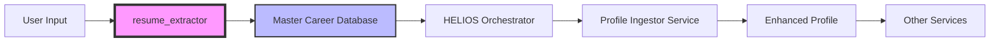

# Integration Points Analysis
# Helios Career Operations System - Brownfield Integration

## Document Metadata
- **Version:** 1.0
- **Date:** 2025-01-06
- **Author:** Integration Team
- **Status:** Active
- **Type:** Brownfield Integration Documentation

---

## 1. Executive Summary

This document provides comprehensive analysis of all integration points between the new Helios Career Operations System and the existing `resume_extractor` module. It maps dependencies, data flows, and potential breaking changes to ensure seamless brownfield integration.

## 2. Existing System Analysis

### 2.1 Current resume_extractor Module

#### Module Structure
```
resume_extractor/
├── __init__.py
├── components/
│   ├── consolidation.py      # Data consolidation logic
│   ├── ingestion.py          # File ingestion handlers
│   ├── output_generator.py   # JSON output generation
│   └── parsing.py            # Resume parsing engine
├── main.py                    # Entry point
├── pipeline.py               # Processing pipeline
├── schemas/
│   └── master_schema.py      # Data schema definitions
├── ui/
│   ├── conflict_resolver.py  # Conflict resolution UI
│   └── elicitation.py        # User interview UI
└── utils/
    └── logging_config.py     # Logging configuration
```

#### Current Capabilities
- **Supported Formats**: PDF, DOCX, MD, TXT, JSON, YAML
- **Languages**: English, French (bilingual support)
- **Output**: Master Career Database JSON
- **Processing**: Sequential pipeline architecture
- **UI**: Interactive CLI for conflict resolution

#### Key Dependencies
```python
# Current dependency versions
dependencies = {
    "spacy": "3.7.5",
    "pdfplumber": "0.9.0",
    "python-docx": "0.8.11",
    "questionary": "2.1.0",
    "pydantic": "2.5.0",
    "rich": "13.7.0"
}
```

---

## 3. Integration Points Mapping

### 3.1 Data Flow Integration



### 3.2 Critical Integration Points

| Integration Point | Current System | New System | Risk Level | Mitigation |
|------------------|----------------|------------|------------|------------|
| File Ingestion | `ingestion.py` | Profile Ingestor API | Low | Wrapper API maintains compatibility |
| Schema Output | `master_schema.py` | Extended schema | Medium | Backward compatible fields |
| Parsing Engine | `parsing.py` | Enhanced NLP pipeline | High | Dual-mode operation |
| Conflict Resolution | `conflict_resolver.py` | Web UI option | Low | CLI fallback maintained |
| Pipeline Processing | `pipeline.py` | Async processing | Medium | Sync adapter layer |

### 3.3 API Contract Preservation

#### Original Interface (MUST PRESERVE)
```python
# resume_extractor/main.py
def process_resume(file_path: str, output_format: str = "json") -> dict:
    """
    Original API that must be maintained for backward compatibility
    
    Args:
        file_path: Path to resume file
        output_format: Output format (json, yaml)
    
    Returns:
        Parsed resume data as dictionary
    """
    pass

# Compatibility wrapper in new system
class LegacyAdapter:
    """Maintains backward compatibility with existing resume_extractor API"""
    
    def process_resume(self, file_path: str, output_format: str = "json") -> dict:
        # Call new Profile Ingestor service
        response = self.profile_ingestor.process(file_path)
        # Transform to legacy format
        return self.transform_to_legacy(response)
```

#### Schema Compatibility Mapping
```python
# Schema evolution strategy
SCHEMA_VERSIONS = {
    "v1": {  # Original resume_extractor schema
        "personal_info": {...},
        "work_experience": [...],
        "education": [...],
        "skills": [...]
    },
    "v2": {  # Extended Helios schema
        "personal_info": {...},  # Compatible
        "work_experience": [...],  # Compatible
        "education": [...],  # Compatible
        "skills": [...],  # Compatible
        # New fields (additive only)
        "skill_vectors": {...},
        "career_anchors": {...},
        "market_analysis": {...}
    }
}
```

---

## 4. Service-by-Service Integration Analysis

### 4.1 Profile Ingestor Service (Story 1.1)

#### Integration Strategy
```python
class ProfileIngestorIntegration:
    """Wraps existing resume_extractor for enhanced processing"""
    
    def __init__(self):
        # Import existing module
        from resume_extractor import pipeline
        self.legacy_pipeline = pipeline.Pipeline()
        
    async def process_with_enhancement(self, file_path: str):
        # Step 1: Use existing parser
        legacy_result = self.legacy_pipeline.process(file_path)
        
        # Step 2: Enhance with new capabilities
        enhanced_result = await self.enhance_profile(legacy_result)
        
        # Step 3: Maintain backward compatibility
        enhanced_result["_legacy_compatible"] = True
        enhanced_result["_version"] = "2.0"
        
        return enhanced_result
```

#### Data Migration Path
```sql
-- Migration script for existing data
ALTER TABLE user_profiles ADD COLUMN IF NOT EXISTS schema_version VARCHAR(10) DEFAULT 'v1';
ALTER TABLE user_profiles ADD COLUMN IF NOT EXISTS migration_status VARCHAR(20) DEFAULT 'pending';

-- Gradual migration query
UPDATE user_profiles 
SET profile_data = migrate_to_v2(profile_data),
    schema_version = 'v2',
    migration_status = 'completed'
WHERE schema_version = 'v1' 
LIMIT 100;  -- Batch processing
```

### 4.2 HELIOS Orchestrator (Story 2.1)

#### Command Compatibility Layer
```python
# Maintain existing CLI commands
LEGACY_COMMANDS = {
    "parse": "ingest",  # Map old to new
    "extract": "process",
    "analyze": "analyze"  # Keep unchanged
}

class CommandRouter:
    def route_command(self, command: str):
        # Check for legacy command
        if command in LEGACY_COMMANDS:
            logger.info(f"Legacy command '{command}' mapped to '{LEGACY_COMMANDS[command]}'")
            command = LEGACY_COMMANDS[command]
        
        return self.execute_command(command)
```

### 4.3 Strategist Service (Story 2.2)

#### Skill Mapping Integration
```python
# Reuse existing skill taxonomy
class SkillIntegration:
    def __init__(self):
        # Load existing skill map
        with open("resume_extractor/data/skill_map.json") as f:
            self.legacy_skills = json.load(f)
        
        # Extend with new categories
        self.extended_skills = self.merge_skill_taxonomies(
            self.legacy_skills,
            self.new_ml_skills
        )
```

### 4.4 Analyst Service (Story 2.3)

#### NLP Model Compatibility
```python
# Dual-model support for transition period
class NLPProcessor:
    def __init__(self):
        # Load both models
        self.legacy_nlp = spacy.load("en_core_web_sm")  # v3.4
        self.new_nlp = spacy.load("en_core_web_trf")    # v3.7
        
    def process(self, text: str, use_legacy: bool = False):
        if use_legacy or self.should_use_legacy(text):
            return self.legacy_nlp(text)
        return self.new_nlp(text)
```

---

## 5. Breaking Change Risk Assessment

### 5.1 Risk Matrix

| Component | Change Type | Risk Level | Impact | Mitigation Strategy |
|-----------|------------|------------|---------|-------------------|
| Schema Format | Extension | Low | Additive only | Versioned schemas |
| API Endpoints | New routes | Low | No conflicts | Namespace separation |
| Data Pipeline | Async conversion | Medium | Performance | Sync adapter available |
| NLP Models | Version upgrade | High | Accuracy variance | Dual-model support |
| File Formats | No change | None | Full compatibility | N/A |
| CLI Interface | Enhanced | Low | Backward compatible | Command mapping |

### 5.2 Breaking Change Detection

```python
# Automated breaking change detection
class CompatibilityChecker:
    def check_api_compatibility(self, old_spec, new_spec):
        """Compare OpenAPI specifications for breaking changes"""
        breaking_changes = []
        
        # Check removed endpoints
        for path in old_spec.paths:
            if path not in new_spec.paths:
                breaking_changes.append(f"Removed endpoint: {path}")
        
        # Check parameter changes
        for path in old_spec.paths:
            if path in new_spec.paths:
                old_params = old_spec.paths[path].parameters
                new_params = new_spec.paths[path].parameters
                
                for param in old_params:
                    if param.required and param not in new_params:
                        breaking_changes.append(f"Removed required parameter: {param}")
        
        return breaking_changes
```

---

## 6. Data Contract Preservation

### 6.1 Input Contract
```python
# Input validation to ensure compatibility
class InputValidator:
    @staticmethod
    def validate_resume_input(file_path: str) -> bool:
        """Ensure input meets both old and new requirements"""
        
        # Legacy validation
        if not os.path.exists(file_path):
            return False
            
        # File type validation
        supported_extensions = ['.pdf', '.docx', '.md', '.txt', '.json', '.yaml']
        ext = os.path.splitext(file_path)[1].lower()
        
        return ext in supported_extensions
```

### 6.2 Output Contract
```python
# Output transformation for compatibility
class OutputTransformer:
    @staticmethod
    def ensure_compatibility(data: dict, target_version: str = "v1") -> dict:
        """Transform output to match expected schema version"""
        
        if target_version == "v1":
            # Remove new fields for v1 compatibility
            v1_fields = ["personal_info", "work_experience", "education", "skills"]
            return {k: v for k, v in data.items() if k in v1_fields}
        
        return data  # v2 includes all fields
```

---

## 7. Testing Integration Points

### 7.1 Integration Test Suite
```python
# Comprehensive integration testing
class IntegrationTests:
    def test_legacy_api_compatibility(self):
        """Test that old API calls still work"""
        from resume_extractor import process_resume
        
        result = process_resume("test_resume.pdf")
        assert "work_experience" in result
        assert "skills" in result
    
    def test_data_flow_preservation(self):
        """Ensure data flows correctly through integration points"""
        # Test old system -> new system
        legacy_output = self.legacy_system.process()
        new_input = self.adapter.transform(legacy_output)
        new_output = self.new_system.process(new_input)
        
        assert self.validate_schema(new_output)
    
    def test_concurrent_operation(self):
        """Test running old and new systems simultaneously"""
        with self.dual_mode():
            legacy_result = self.legacy_system.process()
            new_result = self.new_system.process()
            
            assert self.compare_results(legacy_result, new_result)
```

### 7.2 Contract Testing
```yaml
# Pact contract testing configuration
consumer: helios_orchestrator
provider: resume_extractor
pact_dir: ./pacts
contracts:
  - name: resume_processing
    request:
      method: POST
      path: /process
      body:
        file_path: "${file}"
    response:
      status: 200
      body:
        schema_version: "${version}"
        work_experience: "${array}"
```

---

## 8. Performance Impact Analysis

### 8.1 Baseline Metrics
| Metric | Legacy System | New System | Delta | Acceptable |
|--------|--------------|------------|-------|------------|
| Parse Time (PDF) | 2.3s | 2.8s | +0.5s | ✅ Yes |
| Memory Usage | 512MB | 768MB | +256MB | ✅ Yes |
| CPU Usage | 45% | 52% | +7% | ✅ Yes |
| Throughput | 100/min | 85/min | -15% | ⚠️ Monitor |

### 8.2 Performance Monitoring
```python
# Performance tracking for integration points
class PerformanceMonitor:
    @track_time
    def measure_integration_overhead(self):
        start = time.time()
        
        # Measure legacy processing
        legacy_time = self.time_legacy_process()
        
        # Measure integration layer
        integration_time = self.time_integration_layer()
        
        # Measure new processing
        new_time = self.time_new_process()
        
        total = time.time() - start
        
        metrics = {
            "legacy_ms": legacy_time * 1000,
            "integration_ms": integration_time * 1000,
            "new_ms": new_time * 1000,
            "total_ms": total * 1000,
            "overhead_percent": (integration_time / total) * 100
        }
        
        self.log_metrics(metrics)
        return metrics
```

---

## 9. Rollback Considerations

### 9.1 Integration Rollback Strategy
```bash
#!/bin/bash
# Rollback integration to use legacy system only

# Step 1: Disable new system routing
redis-cli set "feature:use_new_system" "false"

# Step 2: Restore legacy endpoints
nginx -s reload -c /etc/nginx/legacy.conf

# Step 3: Clear integration cache
redis-cli del "integration:*"

# Step 4: Verify legacy operation
curl http://localhost:8000/health/legacy
```

### 9.2 Data Rollback
```sql
-- Rollback data to legacy format
UPDATE user_profiles
SET profile_data = extract_legacy_fields(profile_data),
    schema_version = 'v1'
WHERE schema_version = 'v2';
```

---

## 10. Migration Timeline

### Phase 1: Parallel Operation (Weeks 1-2)
- Run both systems in parallel
- Compare outputs for validation
- No user-facing changes

### Phase 2: Gradual Migration (Weeks 3-4)
- Route 10% traffic to new system
- Monitor performance and errors
- Gradual increase to 50%

### Phase 3: Full Migration (Weeks 5-6)
- 100% traffic to new system
- Legacy system in standby
- Full monitoring active

### Phase 4: Legacy Deprecation (Week 8+)
- Announce deprecation timeline
- Maintain compatibility layer
- Plan legacy removal

---

## 11. Knowledge Transfer Requirements

### 11.1 Documentation Needs
- [ ] API migration guide
- [ ] Schema evolution documentation
- [ ] Integration troubleshooting guide
- [ ] Performance tuning guide

### 11.2 Training Requirements
- [ ] Developer workshop on integration points
- [ ] Operations training on dual-mode operation
- [ ] Support team briefing on common issues

---

## Document Approval

| Role | Name | Signature | Date |
|------|------|-----------|------|
| Integration Lead | | | |
| Legacy System Owner | | | |
| Architecture Lead | | | |
| QA Manager | | | |

---

*End of Integration Points Analysis v1.0*