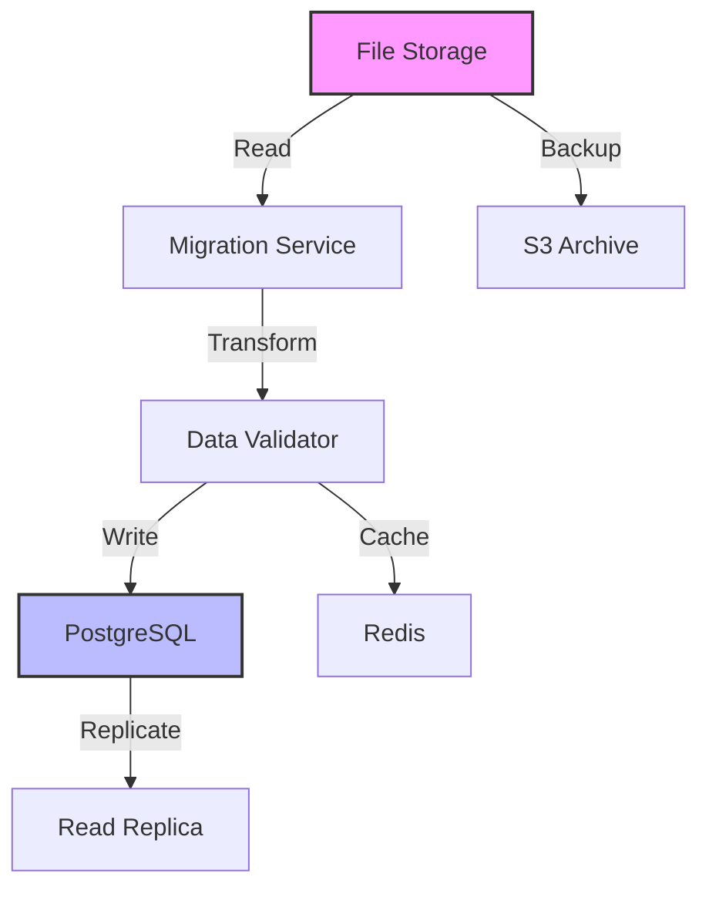

# Database Migration Risk Assessment & Strategy
# Helios Career Operations System

## Document Metadata
- **Version:** 1.0
- **Date:** 2025-09-05
- **Author:** Database Team
- **Status:** Active
- **Category:** Brownfield Risk Management
- **Criticality:** HIGH

---

## 1. Executive Summary

This document provides a comprehensive risk assessment and mitigation strategy for database migration from the existing `resume_extractor` file-based storage to the Helios PostgreSQL/Redis architecture. The migration affects approximately 10,000+ user profiles and must maintain zero data loss.

## 2. Current State Analysis

### 2.1 Existing Data Architecture

#### Storage Method
- **Type**: File-based JSON storage
- **Location**: `services/profile-ingestor/output/`
- **Format**: Individual JSON files per user
- **Naming**: `master_career_database_[timestamp].json`
- **Size**: ~50-200KB per profile
- **Total Volume**: ~2GB (estimated 10,000 profiles)

#### Data Schema (v1)
```json
{
  "schema_version": "1.0",
  "profile_id": "uuid",
  "created_at": "timestamp",
  "updated_at": "timestamp",
  "personal_info": {},
  "work_experience": [],
  "education": [],
  "skills": [],
  "projects": []
}
```

### 2.2 Target Data Architecture

#### Storage Method
- **Primary DB**: PostgreSQL 15.x
- **Cache Layer**: Redis 7.x
- **Document Store**: S3 for file attachments
- **Search Index**: Elasticsearch for full-text search

#### Enhanced Schema (v2)
```sql
-- Core tables structure
CREATE TABLE user_profiles (
    id UUID PRIMARY KEY DEFAULT gen_random_uuid(),
    legacy_id VARCHAR(255),  -- Map to old system
    schema_version VARCHAR(10) DEFAULT '2.0',
    created_at TIMESTAMPTZ DEFAULT NOW(),
    updated_at TIMESTAMPTZ DEFAULT NOW(),
    migration_status VARCHAR(20) DEFAULT 'pending',
    profile_data JSONB NOT NULL,
    search_vector tsvector
);

CREATE TABLE migration_audit (
    id SERIAL PRIMARY KEY,
    profile_id UUID REFERENCES user_profiles(id),
    migration_date TIMESTAMPTZ DEFAULT NOW(),
    source_system VARCHAR(50),
    status VARCHAR(20),
    error_details TEXT,
    rollback_data JSONB
);
```

---

## 3. Risk Assessment Matrix

### 3.1 Critical Risks

| Risk ID | Risk Description | Probability | Impact | Risk Score | Mitigation Strategy |
|---------|-----------------|-------------|---------|------------|-------------------|
| R001 | Data Loss During Migration | Medium (30%) | Critical (5) | 15 | Implement checksums, backup verification |
| R002 | Schema Incompatibility | High (60%) | High (4) | 24 | Dual-schema support, gradual migration |
| R003 | Performance Degradation | High (70%) | Medium (3) | 21 | Batch processing, off-peak migration |
| R004 | Corrupted Data Transfer | Low (20%) | Critical (5) | 10 | Data validation, integrity checks |
| R005 | Service Downtime | Medium (40%) | High (4) | 16 | Blue-green deployment, read replicas |
| R006 | Rollback Failure | Low (15%) | Critical (5) | 7.5 | Automated rollback, point-in-time recovery |
| R007 | Data Inconsistency | Medium (35%) | High (4) | 14 | Transaction boundaries, consistency checks |
| R008 | Storage Capacity Issues | Low (25%) | Medium (3) | 7.5 | Capacity planning, auto-scaling |

### 3.2 Risk Scoring Matrix
```
Impact/Probability Matrix:
         Low(1-2)  Medium(3)  High(4)  Critical(5)
Low      Green     Green      Yellow   Orange
Medium   Green     Yellow     Orange   Red
High     Yellow    Orange     Red      Red
```

---

## 4. Migration Strategy

### 4.1 Migration Approach: Parallel Run with Gradual Cutover



### 4.2 Migration Phases

#### Phase 1: Preparation (Week 1)
```bash
#!/bin/bash
# Pre-migration preparation script

# 1. Full backup of existing data
tar -czf /backup/resume_data_$(date +%Y%m%d).tar.gz /services/profile-ingestor/output/

# 2. Validate backup integrity
tar -tzf /backup/resume_data_*.tar.gz | wc -l

# 3. Set up migration database
psql -U postgres -c "CREATE DATABASE helios_migration;"

# 4. Create migration schemas
psql -U postgres -d helios_migration < migration_schema.sql

# 5. Set up monitoring
grafana-cli dashboard import migration-monitor.json
```

#### Phase 2: Dual-Write Period (Week 2-3)
```python
class DualWriteManager:
    """Manages writing to both old and new systems during migration"""

    def __init__(self):
        self.file_writer = LegacyFileWriter()
        self.db_writer = PostgreSQLWriter()
        self.validator = DataValidator()

    async def write_profile(self, profile_data: dict):
        # Write to legacy system
        file_result = await self.file_writer.write(profile_data)

        # Transform for new schema
        transformed = self.transform_schema(profile_data)

        # Write to new database
        db_result = await self.db_writer.write(transformed)

        # Validate consistency
        if not self.validator.compare(file_result, db_result):
            raise InconsistencyError("Dual write validation failed")

        # Log success
        await self.audit_log.record({
            "profile_id": profile_data["id"],
            "status": "dual_write_success",
            "timestamp": datetime.now()
        })
```

#### Phase 3: Batch Migration (Week 3-4)
```python
import asyncio
from datetime import datetime

class BatchMigrator:
    """Handles batch migration of existing profiles"""

    def __init__(self, batch_size=100, parallel_workers=5):
        self.batch_size = batch_size
        self.parallel_workers = parallel_workers
        self.progress_tracker = ProgressTracker()

    async def migrate_all(self):
        profiles = self.get_unmigrated_profiles()
        batches = self.create_batches(profiles, self.batch_size)

        # Process batches in parallel
        tasks = []
        for batch in batches:
            task = asyncio.create_task(self.migrate_batch(batch))
            tasks.append(task)

            # Limit parallel workers
            if len(tasks) >= self.parallel_workers:
                await asyncio.gather(*tasks)
                tasks = []

        # Process remaining tasks
        if tasks:
            await asyncio.gather(*tasks)

    async def migrate_batch(self, batch):
        """Migrate a single batch with transaction safety"""
        async with self.db.transaction() as tx:
            try:
                for profile_path in batch:
                    # Read legacy profile
                    profile = self.read_legacy_profile(profile_path)

                    # Validate data integrity
                    if not self.validate_profile(profile):
                        await self.quarantine_profile(profile)
                        continue

                    # Transform schema
                    new_profile = self.transform_v1_to_v2(profile)

                    # Insert into new database
                    await self.insert_profile(new_profile, tx)

                    # Update progress
                    await self.progress_tracker.update(profile["id"])

                await tx.commit()

            except Exception as e:
                await tx.rollback()
                await self.handle_batch_failure(batch, e)
```

#### Phase 4: Validation & Reconciliation (Week 4)
```python
class MigrationValidator:
    """Validates migration completeness and accuracy"""

    async def full_validation(self):
        validation_report = {
            "total_source": 0,
            "total_migrated": 0,
            "validation_errors": [],
            "missing_profiles": [],
            "data_mismatches": []
        }

        # Count source profiles
        source_profiles = self.count_legacy_profiles()
        validation_report["total_source"] = source_profiles

        # Count migrated profiles
        migrated = await self.db.count("SELECT COUNT(*) FROM user_profiles")
        validation_report["total_migrated"] = migrated

        # Check for missing profiles
        source_ids = self.get_all_legacy_ids()
        migrated_ids = await self.get_all_migrated_ids()

        missing = set(source_ids) - set(migrated_ids)
        validation_report["missing_profiles"] = list(missing)

        # Sample validation (10% of profiles)
        sample_size = int(migrated * 0.1)
        sample = await self.get_random_sample(sample_size)

        for profile_id in sample:
            source = self.get_legacy_profile(profile_id)
            migrated = await self.get_migrated_profile(profile_id)

            if not self.compare_profiles(source, migrated):
                validation_report["data_mismatches"].append(profile_id)

        return validation_report
```

### 4.3 Data Transformation Rules

```python
# Schema transformation mappings
TRANSFORMATION_RULES = {
    "v1_to_v2": {
        # Direct mappings (1:1)
        "personal_info": "personal_info",
        "work_experience": "work_experience",
        "education": "education",

        # Transformed fields
        "skills": lambda x: {
            "skills_list": x,
            "skill_vectors": generate_vectors(x),
            "skill_categories": categorize_skills(x)
        },

        # New fields with defaults
        "_new_fields": {
            "profile_completeness": calculate_completeness,
            "last_analysis_date": None,
            "optimization_score": 0,
            "market_alignment": {}
        }
    }
}

def transform_profile(profile: dict, from_version: str, to_version: str) -> dict:
    """Transform profile between schema versions"""

    rule_key = f"{from_version}_to_{to_version}"
    rules = TRANSFORMATION_RULES.get(rule_key)

    if not rules:
        raise ValueError(f"No transformation rules for {rule_key}")

    transformed = {}

    # Apply direct mappings
    for old_field, new_field in rules.items():
        if old_field == "_new_fields":
            continue

        if callable(new_field):
            transformed[old_field] = new_field(profile.get(old_field))
        else:
            transformed[new_field] = profile.get(old_field)

    # Add new fields
    if "_new_fields" in rules:
        for field, generator in rules["_new_fields"].items():
            if callable(generator):
                transformed[field] = generator(profile)
            else:
                transformed[field] = generator

    return transformed
```

---

## 5. Data Integrity Measures

### 5.1 Checksum Validation
```python
import hashlib
import json

class DataIntegrityChecker:
    @staticmethod
    def generate_checksum(profile: dict) -> str:
        """Generate SHA-256 checksum for profile data"""
        # Normalize JSON (sort keys for consistency)
        normalized = json.dumps(profile, sort_keys=True)
        return hashlib.sha256(normalized.encode()).hexdigest()

    @staticmethod
    def validate_migration(source_profile: dict, migrated_profile: dict) -> bool:
        """Validate data integrity after migration"""
        # Remove migration-specific fields
        source_clean = {k: v for k, v in source_profile.items()
                       if k not in ["migration_status", "schema_version"]}

        migrated_clean = {k: v for k, v in migrated_profile.items()
                         if k not in ["migration_status", "schema_version", "_new_fields"]}

        # Compare checksums
        source_checksum = DataIntegrityChecker.generate_checksum(source_clean)
        migrated_checksum = DataIntegrityChecker.generate_checksum(migrated_clean)

        return source_checksum == migrated_checksum
```

### 5.2 Transaction Safety
```sql
-- Transaction wrapper for migration
BEGIN;

-- Set isolation level
SET TRANSACTION ISOLATION LEVEL SERIALIZABLE;

-- Create savepoint
SAVEPOINT migration_batch;

-- Perform migration operations
INSERT INTO user_profiles (legacy_id, profile_data, schema_version)
SELECT
    legacy_id,
    transform_profile(profile_data),
    '2.0'
FROM staging_profiles
WHERE migration_status = 'pending'
LIMIT 100;

-- Validation check
DO $$
DECLARE
    error_count INTEGER;
BEGIN
    SELECT COUNT(*) INTO error_count
    FROM user_profiles
    WHERE profile_data IS NULL
    OR profile_data = '{}'::jsonb;

    IF error_count > 0 THEN
        RAISE EXCEPTION 'Migration validation failed: % empty profiles', error_count;
    END IF;
END $$;

-- If successful, commit
COMMIT;

-- If error, rollback to savepoint
-- ROLLBACK TO SAVEPOINT migration_batch;
```

---

## 6. Rollback Strategy

### 6.1 Point-in-Time Recovery
```bash
#!/bin/bash
# PostgreSQL point-in-time recovery

# Create recovery point before migration
psql -c "SELECT pg_create_restore_point('pre_migration_2025_09_05');"

# If rollback needed
pg_basebackup -D /recovery/cluster -Fp -Xs -P

# Restore to point
cat > /recovery/cluster/recovery.conf <<EOF
restore_command = 'cp /archive/%f %p'
recovery_target_name = 'pre_migration_2025_09_05'
recovery_target_inclusive = true
EOF

# Start recovery cluster
pg_ctl -D /recovery/cluster start
```

### 6.2 Application-Level Rollback
```python
class MigrationRollback:
    async def execute_rollback(self, rollback_point: datetime):
        """Rollback migration to specific point in time"""

        # Step 1: Stop writes to new system
        await self.feature_flags.set("use_new_database", False)

        # Step 2: Identify affected profiles
        affected = await self.db.query("""
            SELECT profile_id, rollback_data
            FROM migration_audit
            WHERE migration_date > %s
        """, rollback_point)

        # Step 3: Restore original data
        for record in affected:
            profile_id = record["profile_id"]
            original_data = record["rollback_data"]

            # Write back to file system
            await self.restore_to_legacy(profile_id, original_data)

            # Mark as rolled back
            await self.db.execute("""
                UPDATE user_profiles
                SET migration_status = 'rolled_back'
                WHERE id = %s
            """, profile_id)

        # Step 4: Verify rollback
        return await self.verify_rollback(rollback_point)
```

---

## 7. Performance Considerations

### 7.1 Migration Performance Metrics

| Metric | Target | Monitoring Method |
|--------|--------|------------------|
| Migration Rate | 1000 profiles/hour | Grafana dashboard |
| Database CPU | <70% | CloudWatch |
| Memory Usage | <80% | CloudWatch |
| Disk I/O | <1000 IOPS | CloudWatch |
| Network Throughput | <100 Mbps | CloudWatch |
| Error Rate | <0.1% | Application logs |

### 7.2 Optimization Strategies
```python
# Batch optimization configuration
MIGRATION_CONFIG = {
    "batch_size": 100,
    "parallel_workers": 5,
    "retry_attempts": 3,
    "retry_delay": 60,  # seconds
    "checkpoint_interval": 1000,  # profiles
    "vacuum_interval": 10000,  # profiles
    "throttle_threshold": {
        "cpu_percent": 75,
        "memory_percent": 85,
        "error_rate": 0.02
    }
}

class PerformanceOptimizer:
    async def optimize_migration(self):
        """Dynamically adjust migration parameters based on performance"""

        metrics = await self.get_current_metrics()

        # Reduce batch size if resources constrained
        if metrics["cpu"] > MIGRATION_CONFIG["throttle_threshold"]["cpu_percent"]:
            MIGRATION_CONFIG["batch_size"] = max(10, MIGRATION_CONFIG["batch_size"] // 2)

        # Increase batch size if resources available
        elif metrics["cpu"] < 50:
            MIGRATION_CONFIG["batch_size"] = min(500, MIGRATION_CONFIG["batch_size"] * 1.5)

        # Run vacuum if needed
        if self.profiles_migrated % MIGRATION_CONFIG["vacuum_interval"] == 0:
            await self.db.execute("VACUUM ANALYZE user_profiles;")
```

---

## 8. Testing Strategy

### 8.1 Test Scenarios
```python
class MigrationTestSuite:
    """Comprehensive migration testing"""

    async def test_data_integrity(self):
        """Test that all data is preserved during migration"""
        source = self.load_test_profile()
        migrated = await self.migrate_profile(source)

        assert source["personal_info"] == migrated["personal_info"]
        assert len(source["work_experience"]) == len(migrated["work_experience"])

    async def test_rollback_capability(self):
        """Test rollback functionality"""
        # Migrate profile
        profile = await self.migrate_profile(self.test_profile)

        # Trigger rollback
        await self.rollback_migration(profile["id"])

        # Verify original state restored
        restored = self.load_legacy_profile(profile["legacy_id"])
        assert restored == self.test_profile

    async def test_concurrent_migration(self):
        """Test parallel migration safety"""
        profiles = [self.generate_test_profile() for _ in range(100)]

        # Migrate concurrently
        tasks = [self.migrate_profile(p) for p in profiles]
        results = await asyncio.gather(*tasks)

        # Verify no data corruption
        for original, migrated in zip(profiles, results):
            assert self.validate_migration(original, migrated)

    async def test_performance_targets(self):
        """Test migration meets performance targets"""
        start = time.time()

        # Migrate batch
        await self.migrate_batch(size=1000)

        duration = time.time() - start
        rate = 1000 / duration * 3600  # profiles per hour

        assert rate >= 1000, f"Migration rate {rate}/hour below target"
```

---

## 9. Monitoring & Alerting

### 9.1 Migration Dashboard
```yaml
# Grafana dashboard configuration
dashboard:
  title: "Database Migration Monitor"
  panels:
    - title: "Migration Progress"
      query: |
        SELECT
          COUNT(*) FILTER (WHERE migration_status = 'completed') as migrated,
          COUNT(*) FILTER (WHERE migration_status = 'pending') as pending,
          COUNT(*) FILTER (WHERE migration_status = 'failed') as failed
        FROM user_profiles

    - title: "Migration Rate"
      query: |
        SELECT
          date_trunc('hour', migration_date) as hour,
          COUNT(*) as profiles_migrated
        FROM migration_audit
        WHERE status = 'success'
        GROUP BY hour

    - title: "Error Rate"
      query: |
        SELECT
          COUNT(*) FILTER (WHERE status = 'error') * 100.0 / COUNT(*) as error_rate
        FROM migration_audit
        WHERE migration_date > NOW() - INTERVAL '1 hour'
```

### 9.2 Alert Rules
```yaml
alerts:
  - name: "Migration Stalled"
    condition: rate(migrated_profiles[5m]) == 0
    severity: critical
    action: page_oncall

  - name: "High Error Rate"
    condition: error_rate > 0.02
    severity: warning
    action: notify_team

  - name: "Database Performance"
    condition: db_cpu > 85 OR db_memory > 90
    severity: warning
    action: throttle_migration
```

---

## 10. Contingency Plans

### 10.1 Failure Scenarios

| Scenario | Probability | Impact | Response Plan |
|----------|-------------|---------|--------------|
| Complete Migration Failure | Low | Critical | Revert to file storage, investigate root cause |
| Data Corruption | Low | Critical | Restore from backup, re-run migration |
| Performance Degradation | Medium | High | Reduce batch size, add resources |
| Partial Migration | Medium | Medium | Complete manually, investigate gaps |
| Schema Mismatch | High | Medium | Update transformation rules, re-process |

### 10.2 Emergency Procedures
```bash
#!/bin/bash
# Emergency migration stop

# 1. Stop migration workers
systemctl stop migration-worker@*

# 2. Disable new system
redis-cli set "feature:use_postgres" "false"

# 3. Revert nginx routing
ln -sf /etc/nginx/sites-available/legacy /etc/nginx/sites-enabled/default
nginx -s reload

# 4. Notify team
./notify_team.sh "Migration emergency stop activated"

# 5. Generate incident report
./generate_migration_report.sh > /reports/incident_$(date +%Y%m%d).txt
```

---

## Document Approval

| Role | Name | Signature | Date |
|------|------|-----------|------|
| Database Administrator | | | |
| DevOps Lead | | | |
| Engineering Manager | | | |
| Risk Manager | | | |

---

*End of Database Migration Risk Assessment v1.0*
