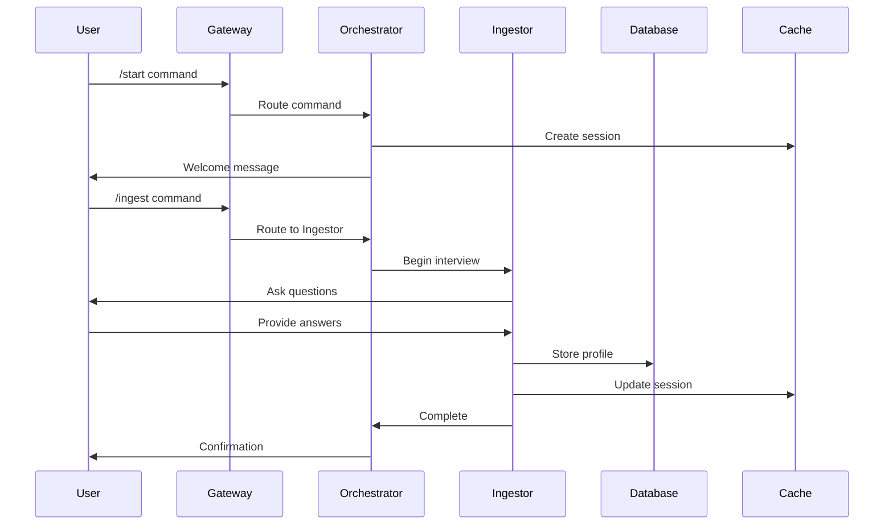

# System Architecture Document
# Helios Career Operations System

## Document Metadata
- **Version:** 1.0
- **Date:** 2025-01-04
- **Author:** Architecture Team
- **Status:** Draft
- **Architecture Type:** Brownfield Extension

---

## 1. Architecture Overview

### 1.1 System Context
The Helios Career Operations System is designed as a multi-agent, event-driven architecture that extends the existing `resume_extractor` module. It implements a sophisticated orchestration layer managing five specialized AI agents, each responsible for distinct aspects of career optimization.

### 1.2 Architecture Style
- **Primary Pattern**: Microservices with Agent Orchestration
- **Secondary Patterns**:
  - Event-Driven Architecture (EDA)
  - Command Query Responsibility Segregation (CQRS)
  - Repository Pattern for data access
  - Chain of Responsibility for agent routing

### 1.3 High-Level System Diagram
```
┌─────────────────────────────────────────────────────────────┐
│                     User Interface Layer                      │
│  ┌──────────┐  ┌──────────┐  ┌──────────┐  ┌──────────┐   │
│  │    CLI   │  │   Web    │  │   API    │  │  Mobile  │   │
│  └──────────┘  └──────────┘  └──────────┘  └──────────┘   │
└─────────────────────────┬───────────────────────────────────┘
                          │
┌─────────────────────────▼───────────────────────────────────┐
│                  API Gateway & Load Balancer                 │
│                     (AWS API Gateway / Kong)                 │
└─────────────────────────┬───────────────────────────────────┘
                          │
┌─────────────────────────▼───────────────────────────────────┐
│                   Orchestration Layer                        │
│  ┌────────────────────────────────────────────────────┐    │
│  │          HELIOS Orchestrator (Main Controller)      │    │
│  │  - Session Management                               │    │
│  │  - Command Routing                                  │    │
│  │  - State Coordination                               │    │
│  └────────────────────────────────────────────────────┘    │
└──────────┬────────┬────────┬────────┬────────┬────────────┘
           │        │        │        │        │
┌──────────▼───┐ ┌──▼───┐ ┌──▼───┐ ┌──▼───┐ ┌──▼───┐
│   PROFILE    │ │STRAT │ │ANAL  │ │ARCH  │ │EDIT  │
│   INGESTOR   │ │EGIST │ │YST   │ │ITECT │ │OR    │
│              │ │      │ │      │ │      │ │      │
│ ◆ Interview  │ │◆ Path│ │◆ 6-  │ │◆ Doc │ │◆ Text│
│ ◆ Profile    │ │  Gen │ │  Step│ │  Gen │ │  Opt │
│ ◆ Validation │ │◆ Fit │ │◆ ATS │ │◆ ATS │ │◆ XYZ │
└──────────────┘ └──────┘ └──────┘ └──────┘ └──────┘
           │        │        │        │        │
┌──────────▼────────▼────────▼────────▼────────▼────────────┐
│                     Data Access Layer                       │
│  ┌─────────────┐  ┌──────────────┐  ┌─────────────────┐   │
│  │  PostgreSQL │  │  Redis Cache │  │  Vector DB      │   │
│  │  (Primary)  │  │  (Session)   │  │  (RAG/Search)   │   │
│  └─────────────┘  └──────────────┘  └─────────────────┘   │
└──────────────────────────────────────────────────────────────┘
           │                    │                    │
┌──────────▼────────────────────▼────────────────────▼────────┐
│                 External Services Layer                      │
│  ┌──────────┐  ┌──────────┐  ┌──────────┐  ┌──────────┐   │
│  │  OpenAI  │  │  spaCy   │  │   AWS    │  │  Job     │   │
│  │Anthropic │  │  Models  │  │   S3     │  │  Boards  │   │
│  └──────────┘  └──────────┘  └──────────┘  └──────────┘   │
└──────────────────────────────────────────────────────────────┘
```

---

## 2. Component Architecture

### 2.1 Core Components

#### 2.1.1 Helios Orchestrator
**Responsibilities:**
- Command interpretation and routing
- Session state management
- Agent lifecycle management
- Error handling and recovery
- Audit logging

**Technology:** Python with FastAPI
**Pattern:** Mediator + Command Pattern

#### 2.1.2 Agent Subsystem
Each agent follows a consistent architecture:
```
┌─────────────────────────────────┐
│         Agent Container          │
├─────────────────────────────────┤
│  ┌───────────────────────────┐  │
│  │    Agent Controller       │  │
│  ├───────────────────────────┤  │
│  │  - Command Handler        │  │
│  │  - Validation Logic       │  │
│  │  - Response Formatter     │  │
│  └──────────┬────────────────┘  │
│             │                    │
│  ┌──────────▼────────────────┐  │
│  │    Business Logic         │  │
│  ├───────────────────────────┤  │
│  │  - Core Algorithms        │  │
│  │  - ML Models              │  │
│  │  - Processing Pipelines   │  │
│  └──────────┬────────────────┘  │
│             │                    │
│  ┌──────────▼────────────────┐  │
│  │    Knowledge Base         │  │
│  ├───────────────────────────┤  │
│  │  - Domain Rules           │  │
│  │  - Templates              │  │
│  │  - Configurations         │  │
│  └───────────────────────────┘  │
└─────────────────────────────────┘
```

### 2.2 Data Architecture

#### 2.2.1 Data Stores
1. **Primary Database (PostgreSQL)**
   - User profiles
   - Session history
   - Generated documents
   - Analytics data

2. **Cache Layer (Redis)**
   - Active session states
   - Temporary processing data
   - Rate limiting counters
   - Hot data cache

3. **Vector Database (Pinecone/Weaviate)**
   - Embedded career profiles
   - Job description embeddings
   - Skill similarity vectors
   - Semantic search indices

#### 2.2.2 Data Flow Patterns
```
User Input → Validation → Processing → Enrichment → Storage → Response
     ↓           ↓            ↓           ↓           ↓          ↓
   Audit     Security    Transform   External     Cache      Format
    Log       Check       & Clean      APIs       Update     Output
```

### 2.3 Integration Architecture

#### 2.3.1 Internal Integration
- **Message Queue**: RabbitMQ/AWS SQS for async agent communication
- **Event Bus**: Redis Pub/Sub for real-time state updates
- **Service Mesh**: Istio for service-to-service communication

#### 2.3.2 External Integration Points
```yaml
integrations:
  llm_providers:
    - service: OpenAI
      purpose: GPT-4 for document generation
      auth: API Key
      rate_limit: 100 req/min

    - service: Anthropic
      purpose: Claude for complex analysis
      auth: API Key
      rate_limit: 50 req/min

  nlp_services:
    - service: spaCy
      purpose: Entity recognition
      deployment: Self-hosted
      models: [en_core_web_trf, fr_dep_news_trf]

  storage:
    - service: AWS S3
      purpose: Document storage
      auth: IAM Role
      encryption: AES-256

  job_boards:
    - service: LinkedIn API
      purpose: Job market data
      auth: OAuth 2.0
      rate_limit: 1000 req/day
```

---

## 3. Security Architecture

### 3.1 Security Layers
```
┌─────────────────────────────────────────┐
│          WAF (Web Application Firewall) │
├─────────────────────────────────────────┤
│          SSL/TLS Termination            │
├─────────────────────────────────────────┤
│          API Rate Limiting              │
├─────────────────────────────────────────┤
│          OAuth 2.0 / JWT Auth           │
├─────────────────────────────────────────┤
│          RBAC Authorization             │
├─────────────────────────────────────────┤
│          Data Encryption Layer          │
├─────────────────────────────────────────┤
│          Audit Logging                  │
└─────────────────────────────────────────┘
```

### 3.2 Data Protection
- **At Rest**: AES-256 encryption for all stored data
- **In Transit**: TLS 1.3 for all communications
- **PII Handling**: Tokenization and pseudonymization
- **Key Management**: AWS KMS or HashiCorp Vault

### 3.3 Compliance Requirements
- GDPR compliance for EU users
- CCPA compliance for California users
- SOC 2 Type II certification target
- ISO 27001 alignment

---

## 4. Deployment Architecture

### 4.1 Infrastructure Design
```
Production Environment (AWS)
├── Region: us-east-1 (Primary)
│   ├── VPC
│   │   ├── Public Subnets (2 AZs)
│   │   │   ├── ALB
│   │   │   └── NAT Gateways
│   │   └── Private Subnets (2 AZs)
│   │       ├── ECS Clusters
│   │       ├── RDS Multi-AZ
│   │       └── ElastiCache
│   └── CloudFront CDN
│
└── Region: us-west-2 (DR)
    └── Standby Infrastructure
```

### 4.2 Container Architecture
```yaml
services:
  orchestrator:
    image: helios/orchestrator:latest
    replicas: 3
    resources:
      cpu: 2
      memory: 4Gi

  profile_ingestor:
    image: helios/profile-ingestor:latest
    replicas: 2
    resources:
      cpu: 1
      memory: 2Gi

  strategist:
    image: helios/strategist:latest
    replicas: 2
    resources:
      cpu: 2
      memory: 4Gi

  analyst:
    image: helios/analyst:latest
    replicas: 3
    resources:
      cpu: 4
      memory: 8Gi

  architect:
    image: helios/architect:latest
    replicas: 2
    resources:
      cpu: 1
      memory: 2Gi

  editor:
    image: helios/editor:latest
    replicas: 2
    resources:
      cpu: 0.5
      memory: 1Gi
```

### 4.3 Scalability Strategy
- **Horizontal Scaling**: Auto-scaling based on CPU/Memory/Queue depth
- **Vertical Scaling**: Reserved for ML model serving
- **Database Scaling**: Read replicas and connection pooling
- **Caching Strategy**: Multi-tier caching (CDN → Application → Database)

---

## 5. Resilience & Error Handling Architecture

### 5.1 Circuit Breaker Patterns

The Helios system implements comprehensive circuit breaker patterns to handle external service failures gracefully.

#### 5.1.1 External Service Circuit Breakers
```python
# Circuit Breaker Configuration
CIRCUIT_BREAKERS = {
    'openai_api': {
        'failure_threshold': 3,      # failures before opening
        'recovery_timeout': 60,      # seconds before retry attempt
        'timeout': 30,               # request timeout
        'fallback': 'use_cached_templates'
    },
    'anthropic_api': {
        'failure_threshold': 3,
        'recovery_timeout': 60,
        'timeout': 30,
        'fallback': 'queue_for_later_processing'
    },
    'vector_database': {
        'failure_threshold': 5,
        'recovery_timeout': 30,
        'timeout': 15,
        'fallback': 'use_sql_similarity_search'
    },
    'spacy_models': {
        'failure_threshold': 2,
        'recovery_timeout': 45,
        'timeout': 10,
        'fallback': 'use_basic_text_processing'
    }
}
```

#### 5.1.2 Retry Policies
```yaml
retry_strategies:
  exponential_backoff:
    initial_delay: 1s
    multiplier: 2
    max_delay: 30s
    max_retries: 3
    jitter: true

  linear_backoff:
    delay: 2s
    max_retries: 5

  immediate_retry:
    max_retries: 1
    use_cases: ["network_timeout", "connection_reset"]
```

#### 5.1.3 Graceful Degradation Strategies
| Service | Primary Function | Degraded Mode | Fallback Action |
|---------|------------------|---------------|-----------------|
| Strategist | ML career path generation | Rule-based paths | Return cached/template paths |
| Analyst | 6-step NLP pipeline | Basic analysis | Simple keyword matching |
| Architect | AI document generation | Template-based | Use predefined templates |
| Editor | AI text optimization | Pattern-based | Apply preset transformations |
| Orchestrator | Agent coordination | Direct routing | Route to available services only |

#### 5.1.4 Health Check & Recovery
```yaml
health_checks:
  frequency: 30s
  timeout: 5s
  endpoints:
    - /health/basic      # Service alive
    - /health/ready      # Dependencies available
    - /health/models     # ML models loaded

recovery_actions:
  service_restart:
    max_attempts: 3
    backoff: exponential

  model_reload:
    triggers: ["memory_error", "model_corruption"]
    timeout: 300s

  cache_clear:
    triggers: ["memory_pressure", "stale_data"]
```

### 5.2 Fault Tolerance Mechanisms

#### 5.2.1 Service Mesh Resilience (Istio)
```yaml
istio_policies:
  retry_policy:
    attempts: 3
    per_try_timeout: 10s
    retry_on: "gateway-error,connect-failure,refused-stream"

  circuit_breaker:
    max_connections: 100
    max_pending_requests: 10
    max_requests_per_connection: 2
    consecutive_errors: 3

  timeout: 30s

  outlier_detection:
    consecutive_errors: 5
    interval: 30s
    base_ejection_time: 30s
```

#### 5.2.2 Database Resilience
```yaml
database_resilience:
  postgresql:
    connection_pooling: true
    max_connections: 100
    connection_timeout: 30s
    statement_timeout: 30s

  redis:
    cluster_mode: true
    sentinel_enabled: true
    failover_timeout: 5s

  vector_db:
    replication_factor: 3
    consistency_level: "eventual"
    backup_strategy: "continuous"
```

---

## 6. Performance Architecture

### 5.1 Performance Targets
| Component | Target Latency | Throughput | Availability |
|-----------|---------------|------------|--------------|
| API Gateway | <100ms | 10,000 req/s | 99.99% |
| Orchestrator | <200ms | 5,000 req/s | 99.95% |
| Profile Ingestor | <5s | 100 req/s | 99.9% |
| Strategist | <3s | 200 req/s | 99.9% |
| Analyst | <10s | 50 req/s | 99.9% |
| Architect | <5s | 100 req/s | 99.9% |
| Editor | <1s | 500 req/s | 99.9% |

### 5.2 Optimization Strategies
1. **Caching**
   - Result caching for repeated analyses
   - Template caching for document generation
   - Session state caching in Redis

2. **Async Processing**
   - Queue-based processing for heavy operations
   - Webhook notifications for completion
   - Progressive enhancement for UI

3. **Database Optimization**
   - Indexed queries
   - Connection pooling
   - Query result caching
   - Materialized views for analytics

---

## 6. Monitoring and Observability

### 6.1 Monitoring Stack
```
Application Metrics → Prometheus → Grafana
           ↓
    Application Logs → ELK Stack → Kibana
           ↓
    Distributed Tracing → Jaeger → Analysis
           ↓
    Error Tracking → Sentry → Alerts
```

### 6.2 Key Metrics
- **Business Metrics**: User sessions, documents generated, success rates
- **System Metrics**: CPU, memory, disk, network utilization
- **Application Metrics**: Request latency, error rates, throughput
- **Agent Metrics**: Processing time, accuracy scores, token usage

### 6.3 Alerting Strategy
| Severity | Response Time | Example Triggers |
|----------|--------------|------------------|
| Critical | <5 min | System down, data breach |
| High | <15 min | Agent failures, >10% error rate |
| Medium | <1 hour | Performance degradation |
| Low | <24 hours | Capacity warnings |

---

## 7. Data Flow Diagrams

### 7.1 User Journey Data Flow


### 7.2 Agent Communication Flow
```
┌─────────────┐      Command      ┌─────────────┐
│ Orchestrator├──────────────────>│   Agent A   │
└─────┬───────┘                   └──────┬──────┘
      │                                   │
      │ Event                            │ Result
      │ Notification                     │
      ▼                                  ▼
┌─────────────┐                   ┌─────────────┐
│ Event Bus   │<───────────────────│ Message    │
│             │    Async Update    │ Queue      │
└─────────────┘                   └─────────────┘
```

---

## 8. Technology Decisions

### 8.1 Technology Stack
| Layer | Technology | Justification |
|-------|------------|---------------|
| Language | Python 3.11+ | AI/ML ecosystem, team expertise |
| Framework | FastAPI | Performance, async support, OpenAPI |
| Database | PostgreSQL | ACID compliance, JSON support |
| Cache | Redis | Performance, pub/sub capability |
| Vector DB | Pinecone | Managed service, performance |
| Queue | RabbitMQ | Reliability, routing flexibility |
| Container | Docker | Portability, consistency |
| Orchestration | Kubernetes | Scalability, self-healing |
| Cloud | AWS | Service ecosystem, team expertise |

### 8.2 AI/ML Stack
| Component | Technology | Purpose |
|-----------|------------|---------|
| LLM | GPT-4, Claude | Document generation, analysis |
| NLP | spaCy | Entity recognition, parsing |
| Embeddings | Sentence-BERT | Semantic similarity |
| ML Framework | PyTorch | Custom model training |
| MLOps | MLflow | Model versioning, tracking |

---

## 9. Development Architecture

### 9.1 Repository Structure
```
helios-career-system/
├── services/
│   ├── orchestrator/
│   ├── agents/
│   │   ├── profile_ingestor/
│   │   ├── strategist/
│   │   ├── analyst/
│   │   ├── architect/
│   │   └── editor/
│   └── shared/
│       ├── models/
│       ├── utils/
│       └── schemas/
├── infrastructure/
│   ├── terraform/
│   ├── kubernetes/
│   └── docker/
├── tests/
│   ├── unit/
│   ├── integration/
│   └── e2e/
└── docs/
    ├── api/
    ├── architecture/
    └── deployment/
```

### 9.2 CI/CD Pipeline
```
Code Push → GitHub Actions → Build → Test → Security Scan → Deploy
    ↓           ↓             ↓       ↓          ↓            ↓
  Lint      Validate      Docker  Unit/Int   Sonar/Snyk   Staging
                                    Tests                     ↓
                                                         Prod Deploy
```

---

## 10. Migration Strategy

### 10.1 From resume_extractor to Helios
1. **Phase 1**: Wrap existing module as microservice
2. **Phase 2**: Add orchestrator layer
3. **Phase 3**: Implement additional agents
4. **Phase 4**: Migrate data to new schema
5. **Phase 5**: Deprecate old interfaces

### 10.2 Data Migration
- ETL pipeline for existing data
- Backward compatibility layer
- Gradual migration with feature flags
- Rollback capability

---

## 11. Disaster Recovery

### 11.1 Backup Strategy
- **Database**: Daily snapshots, point-in-time recovery
- **Documents**: S3 versioning and cross-region replication
- **Configuration**: Git-based config management

### 11.2 Recovery Targets
- **RPO (Recovery Point Objective)**: 1 hour
- **RTO (Recovery Time Objective)**: 4 hours
- **Degraded Mode**: Core functions within 30 minutes

---

## 12. Cost Architecture

### 12.1 Cost Breakdown (Monthly Estimate)
| Component | Cost | Notes |
|-----------|------|-------|
| Compute (ECS) | $2,000 | Auto-scaling enabled |
| Database (RDS) | $500 | Multi-AZ deployment |
| Storage (S3) | $200 | Lifecycle policies |
| CDN (CloudFront) | $300 | Global distribution |
| AI/ML APIs | $3,000 | Volume discounts |
| Monitoring | $400 | Full observability |
| **Total** | **$6,400** | Per 1000 active users |

### 12.2 Cost Optimization
- Reserved instances for predictable workloads
- Spot instances for batch processing
- Intelligent tiering for S3 storage
- API caching to reduce LLM calls

---

## 13. Architecture Decision Records (ADRs)

### ADR-001: Microservices over Monolith
**Decision**: Adopt microservices architecture
**Rationale**: Independent scaling, technology diversity, team autonomy
**Consequences**: Increased complexity, network overhead

### ADR-002: Python as Primary Language
**Decision**: Use Python for all services
**Rationale**: AI/ML ecosystem, team expertise, rapid development
**Consequences**: Performance limitations for compute-intensive tasks

### ADR-003: Event-Driven Communication
**Decision**: Use events for agent communication
**Rationale**: Loose coupling, scalability, resilience
**Consequences**: Eventual consistency, debugging complexity

---

## 14. Appendices

### Appendix A: API Endpoints
```yaml
endpoints:
  public:
    - POST /api/v1/sessions/start
    - POST /api/v1/commands/{command}
    - GET /api/v1/sessions/{id}/status
    - GET /api/v1/documents/{id}

  admin:
    - GET /api/admin/metrics
    - POST /api/admin/agents/{id}/restart
    - GET /api/admin/logs
```

### Appendix B: Environment Variables
```bash
# Core Configuration
HELIOS_ENV=production
HELIOS_LOG_LEVEL=INFO
HELIOS_PORT=8000

# Database
DB_HOST=postgres.internal
DB_PORT=5432
DB_NAME=helios

# Cache
REDIS_URL=redis://cache.internal:6379

# AI Services
OPENAI_API_KEY=${SECRET_OPENAI_KEY}
ANTHROPIC_API_KEY=${SECRET_ANTHROPIC_KEY}

# Monitoring
PROMETHEUS_PORT=9090
JAEGER_ENDPOINT=http://jaeger:14268
```

---

## Document Approval

| Role | Name | Signature | Date |
|------|------|-----------|------|
| Chief Architect | | | |
| Tech Lead | | | |
| DevOps Lead | | | |
| Security Lead | | | |

---

*End of Architecture Document v1.0*
