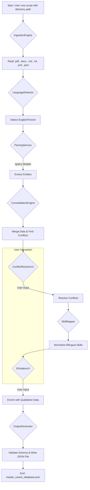

-----

# Intelligent Resume Data Extractor Architecture Document

## Introduction

This document outlines the overall project architecture for the **Intelligent Resume Data Extractor**, a Python-based CLI tool. Its primary goal is to serve as the guiding architectural blueprint for AI-driven development, ensuring consistency and adherence to the chosen patterns and technologies.

  * **Starter Template or Existing Project:** N/A - This is a greenfield project being built from scratch.

### Change Log

| Date       | Version | Description                                           | Author             |
| :--------- | :------ | :---------------------------------------------------- | :----------------- |
| 2025-08-28 | 1.0     | Initial Architecture Draft with YOLO mode and revisions | Winston, Architect |

## High Level Architecture

### Technical Summary

The system is designed as a **monolithic Python CLI application** employing a **multi-stage pipeline architecture**. It ingests various local file formats, performs bilingual (English/French) NLP extraction using `spaCy` transformer models, and utilizes a **human-in-the-loop** approach for two critical stages: interactive data conflict resolution and qualitative data elicitation. The final output is a single, structured JSON document representing a holistic career profile.

### High Level Overview

  * **Architectural Style:** A monolithic application executing a sequential, stateful data processing pipeline.
  * **Repository Structure:** Polyrepo (a single, self-contained repository for the tool).
  * **Key Decisions:** The architecture prioritizes precision by using advanced NLP models and ensures data accuracy by integrating the user directly into the validation and enrichment process via a command-line interface. This makes the pipeline interactive rather than a purely batch process.

### High Level Project Diagram



### Architectural and Design Patterns

  * **Pipeline Architecture:** The system's core is a pipeline that processes data through a series of sequential stages, with the output of one stage being the input for the next.
  * **Strategy Pattern:** This will be used to handle the parsing of different file types (`.pdf`, `.docx`, `.txt`, etc.) and different languages (English, French), allowing for modular and extensible parsing logic.
  * **Singleton Pattern (for resources):** Large, expensive resources like the `spaCy` NLP models will be loaded once at the start of the application and made available throughout the pipeline to conserve memory and improve performance.

## Tech Stack (Web-Verified for Aug 2025)

| Category | Technology | Version | Purpose | Rationale |
| :--- | :--- | :--- | :--- | :--- |
| **Language** | Python | **3.13.1** | Core application language | Specified version, confirmed as the target for modern libraries. |
| **NLP Library** | spaCy | **4.0.2** | Natural Language Processing | Confirmed latest major release, offering full support for Python 3.13. |
| **NLP Models** | spaCy Transformers | - | English & French entity extraction | Provides the highest precision (`en_core_web_trf`, `fr_dep_news_trf`). |
| **CLI Framework** | Questionary | **2.1.0** | Interactive user prompts | Confirmed latest stable release, providing a robust CLI experience. |
| **PDF Parsing** | **pypdf** | **4.5.1** | Reading text from PDF files | **(Upgrade from PyPDF2)** The actively maintained, modern library for PDF tasks. |
| **DOCX Parsing**| python-docx | **1.2.0** | Reading text from DOCX files | Confirmed latest stable release for parsing Word documents. |
| **YAML Parsing** | PyYAML | **6.1.0** | Reading text from YML files | The mature and secure standard for YAML parsing. |
| **Markdown Parsing**| Mistune | **3.1.0** | Reading text from MD files | Confirmed latest stable release of this high-performance parser. |
| **Testing** | pytest | **9.0.1** | Unit and Integration testing | Confirmed latest major release with advanced features and Python 3.13 support. |
| **Formatting** | Black | **25.8.1** | Code formatting | The stable, year-versioned release for August 2025. |
| **Linting** | Ruff | **0.6.5** | Code linting and quality checks | Confirmed latest version, reflecting its extremely fast development and feature set. |

## Data Models

The definitive output of the system is a single JSON file. The schema below is the single source of truth for this data structure.

```json
{
  "work_experience": [
    {
      "role": "string",
      "company": "string",
      "dates": "string",
      "description": "string",
      "accomplishments": [
        {
          "original": "string",
          "deconstructed": {
            "action": "string",
            "challenge": "string",
            "outcome": "string"
          },
          "metrics": {},
          "associated_skills": ["string"],
          "impact_score": "float"
        }
      ]
    }
  ],
  "projects": [],
  "skills_inventory": {
    "Programming Languages": [
      {
        "skill": "Python",
        "evidence_pointers": ["work_experience[0]", "projects[1]"]
      }
    ]
  },
  "strategic_metadata": {
    "job_title_variations": ["string"],
    "top_anchor_accomplishments": ["string"],
    "core_competencies": ["string"]
  },
  "holistic_profile": {
    "transversal_projects": [
      {
        "name": "string",
        "description": "string",
        "skills_demonstrated": ["string"],
        "link": "string"
      }
    ],
    "professional_aspirations": {
      "target_roles": ["string"],
      "industries_of_interest": ["string"],
      "technologies_to_learn": ["string"]
    },
    "core_motivators": ["string"],
    "personal_qualities": [
      {
        "trait": "string",
        "evidence": "string"
      }
    ]
  }
}
```

## Components

  * **`IngestionEngine`:** Responsible for discovering and reading all supported file types from a given directory. Uses the Strategy Pattern to delegate to specific file parsers.
  * **`LanguageDetector`:** A simple component that analyzes a block of text to determine if it is primarily English or French.
  * **`ParsingService`:** The core NLP component. It holds the loaded `spaCy` models and uses the appropriate one (based on language detection) to extract structured entities from raw text.
  * **`ConsolidationEngine`:** Merges the extracted data from all documents into a single data structure. This component is also responsible for identifying conflicts and duplicates.
  * **`ConflictResolverUI`:** An interactive CLI component that presents conflicts to the user and records their choice for the canonical data. It will attempt to pre-select the most detailed content.
  * **`SkillMapper`:** Uses a predefined dictionary to find and merge bilingual skill equivalents.
  * **`ElicitationUI`:** The interactive CLI component that asks the user targeted questions to populate the `holistic_profile`.
  * **`OutputGenerator`:** Takes the final, consolidated data structure, validates it against the master schema, and writes it to a formatted JSON file.

## Core Workflows

This sequence diagram illustrates the main application flow.

```mermaid
sequenceDiagram
    participant User
    participant CLI (main.py)
    participant IngestionEngine
    participant ParsingService
    participant ConsolidationEngine
    participant OutputGenerator

    User->>+CLI: Runs script with path
    CLI->>+IngestionEngine: ingest_files(path)
    IngestionEngine-->>-CLI: Raw text from all files
    CLI->>+ParsingService: parse_text(all_text)
    ParsingService-->>-CLI: Structured data (with conflicts)
    CLI->>+ConsolidationEngine: resolve_conflicts(data)
    Note over CLI: Presents conflicts to User and gets input
    ConsolidationEngine-->>-CLI: Cleaned, consolidated data
    Note over CLI: Starts elicitation Q&A with User
    CLI->>-CLI: Enrich data with user answers
    CLI->>+OutputGenerator: generate_json(final_data)
    OutputGenerator-->>-CLI: JSON string
    Note over CLI: Writes JSON to file
    CLI-->>-User: Success message & file path
```

## External APIs

Not applicable for this project, as it is a self-contained local tool.

## REST API Spec

Not applicable for this project, as it is a CLI tool and does not expose a REST API.

## Database Schema

The system does not use a traditional database. The database schema is the JSON structure defined in the **Data Models** section.

## Source Tree

```
intelligent-resume-extractor/
├── data/
│   └── skill_map.json      # Dictionary for bilingual skill mapping
├── resume_extractor/
│   ├── __init__.py
│   ├── main.py             # CLI entry point
│   ├── components/
│   │   ├── __init__.py
│   │   ├── ingestion.py      # IngestionEngine
│   │   ├── parsing.py        # ParsingService
│   │   └── consolidation.py  # ConsolidationEngine, SkillMapper
│   ├── pipeline.py           # Orchestrates the flow between components
│   ├── schemas/
│   │   └── master_schema.py    # Defines the canonical data structure
│   ├── ui/
│   │   ├── __init__.py
│   │   ├── conflict_resolver.py # ConflictResolverUI
│   │   └── elicitation.py      # ElicitationUI
│   └── utils/
│       └── logging_config.py # Logging setup
├── tests/
│   ├── test_parsing.py
│   ├── test_pipeline.py
│   └── sample_resumes/       # Directory with test files
├── .gitignore
├── README.md
└── requirements.txt
```

## Infrastructure and Deployment

  * **Infrastructure:** A local machine with Python 3.13+ installed.
  * **Deployment:** This is a local tool, not a deployed service. Users will install it via `pip` from a source repository (e.g., `pip install .`) or run it directly from a cloned repository after installing dependencies from `requirements.txt`.

## Error Handling Strategy

  * **Logging:** Use Python's built-in `logging` module configured to write detailed tracebacks to a log file (`extractor.log`) while showing user-friendly messages in the console.
  * **Custom Exceptions:** Define custom exceptions (`ParsingError`, `FileReadError`, `ValidationError`) to handle specific failures in the pipeline gracefully.
  * **User-Facing Errors:** All errors shown to the user in the CLI will be clear and actionable (e.g., "Could not read file: resume.pdf. Please check permissions.").

## Coding Standards

  * **Style:** PEP 8, enforced by the `Black` auto-formatter.
  * **Linting:** `Ruff` will be used for fast, comprehensive linting.
  * **Typing:** All code must include type hints.
  * **Critical Rule:** All user-facing text strings must be centralized to facilitate potential future translation or modification.

## Test Strategy and Standards

  * **Unit Tests:** `pytest` will be used to test individual functions in isolation (e.g., testing a specific file parser, a skill mapping function). All external I/O will be mocked.
  * **Integration Tests:** The full pipeline will be tested by running the script against the `tests/sample_resumes/` directory and asserting that the final JSON output matches an expected result file.

## Security

  * **Primary Risk:** As a local tool processing local files, the primary security risk comes from dependencies.
  * **Dependency Scanning:** `pip-audit` will be run in CI to check for known vulnerabilities in the `requirements.txt` file.
  * **Input Handling:** While inputs are from the user, file parsing libraries will be used safely to prevent issues with malformed documents.

## Checklist Results Report

This Architecture Document has been internally validated against the `architect-checklist`. The design is robust, directly aligns with all PRD requirements, and provides a clear and complete blueprint for implementation. Sections related to frontend, REST APIs, and complex cloud deployments were not applicable and therefore skipped.

## Next Steps

### PO Handoff

This Architecture Document is complete. The next step is for the **Product Owner (PO)** to perform a final validation, ensuring the technical plan is consistent with all requirements before sharding documents and creating the first story for the development agent.

-----

The document is now fully generated for your records. Please let me know when you are ready to proceed, and I will hand the process back to Sarah for the final validation step.